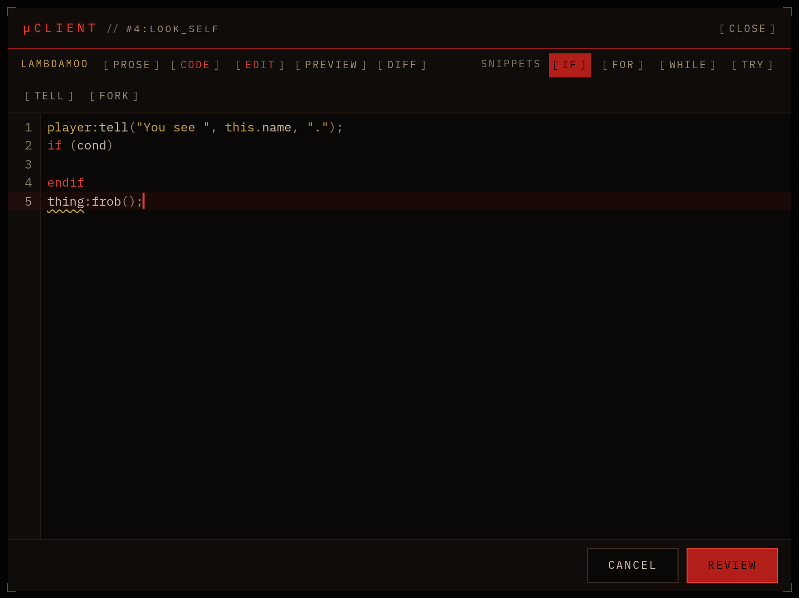
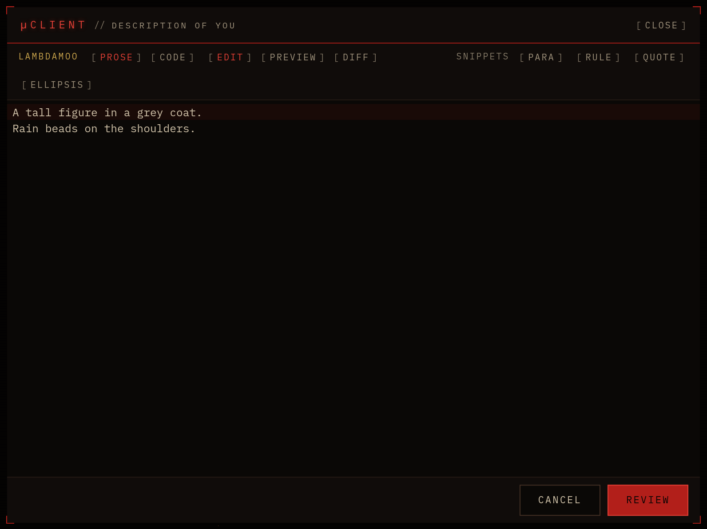
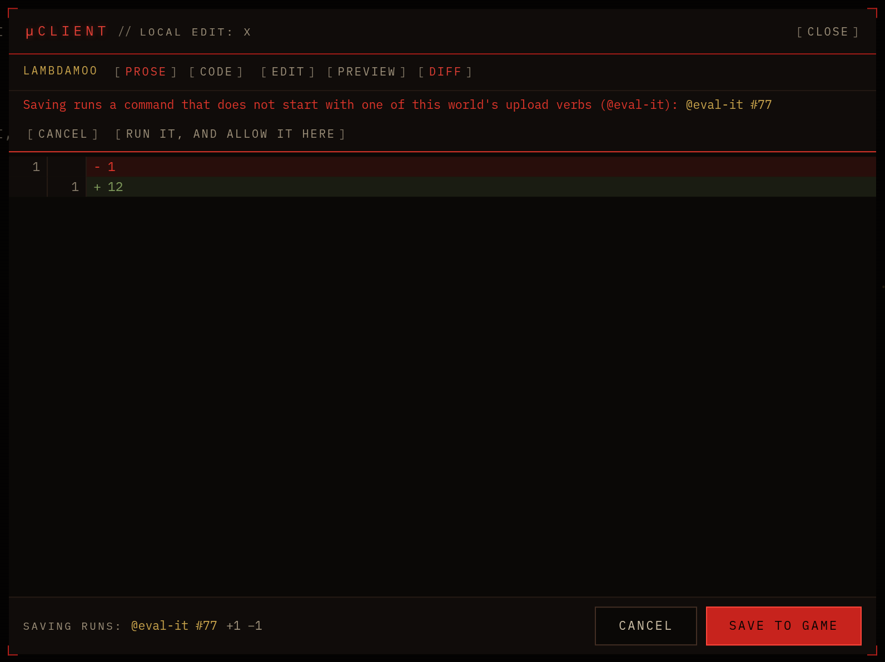

# MOO editor

A code editor for MOO games in [μClient](https://runmu.sh). When the game hands you text to edit (a verb, a
description, a note), it opens here with MOO syntax colours and a linter. **Program** sends it straight back.



| | |
|---|---|
|  |  |

## What it does

- **MCP simpleedit** (`dns-org-mud-moo-simpleedit` 1.0). The game's `@edit` opens the editor. **Program** (or **Save**
  for text) sends `-set` with the text, one line per line. A save made on two of your devices reaches the game once.
- **LambdaCore local edit** (`#$# edit name: … upload: …`), for MOOs without MCP 2.1. It is off by default. Turn it
  on per world in Settings → Extensions → MOO editor → **Accept LambdaCore local editing**. The footer shows
  the command Save runs ("Saving runs: `@program #4:look`"). A command that doesn't start with one of the world's
  upload verbs (Settings → Input; by default `@program`, `@set-note-text`, `@set-note-value`) asks first, once per
  world. It turns itself off when the game speaks MCP 2.1.
- **The editor itself**, for any editor μClient opens in MOO code, text or Markdown (IRE.Composer, other
  extensions):
  - **Code** mode: line numbers, MOO highlighting, and a linter for unbalanced blocks and undefined variables.
    **Prose** mode wraps lines.
  - **Preview** renders ANSI colour codes in your terminal palette.
  - **Program** (Save for text) sends at once, with no review step. Ctrl+S does the same.
  - Unsaved edits ask before the editor closes. Your draft follows you to your other devices.
  - New text from the game while you are editing shows **Take it** instead of replacing your work.
  - Colours come from your theme.

Without this extension μClient opens these editors as a plain text box.

## Settings

| Setting | Default | |
|---|---|---|
| Accept LambdaCore local editing (#$# edit) | off, per world | See above. |
| Check MOO code as you type | on | The linter. |
| Text opens in | auto | Code for MOO code, prose for text; or always one. |

## How it is built

`src/index.ts` is the entry (5 KB). It handles the protocols and registers the editor UI with
`mu.editor.provide`. The editor (CodeMirror 6, the MOO language, the theme) is the lazy module `dist/editor.js`. It
is listed in `muclient.modules`, pinned by sha256, and loaded with `mu.modules.load` the first time an editor
opens (SDK 1.13).

```
npm install
npm run build      # dist/index.js and dist/editor.js; re-pins the module hash in package.json
npm test           # headless host (@runmu.sh/dev/test)
npm run dev        # dev server; μClient → Extensions → Developer
```

## License

MIT
